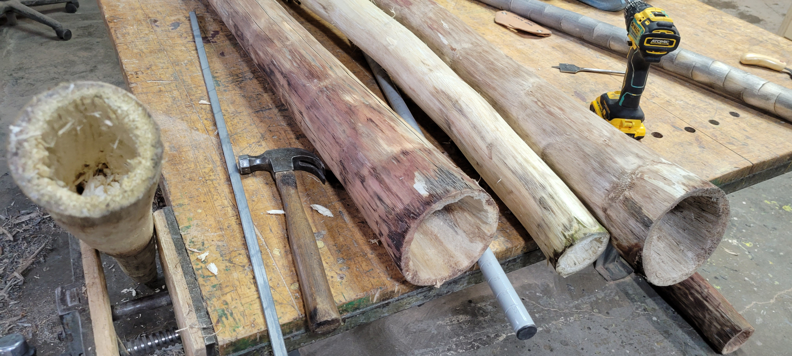
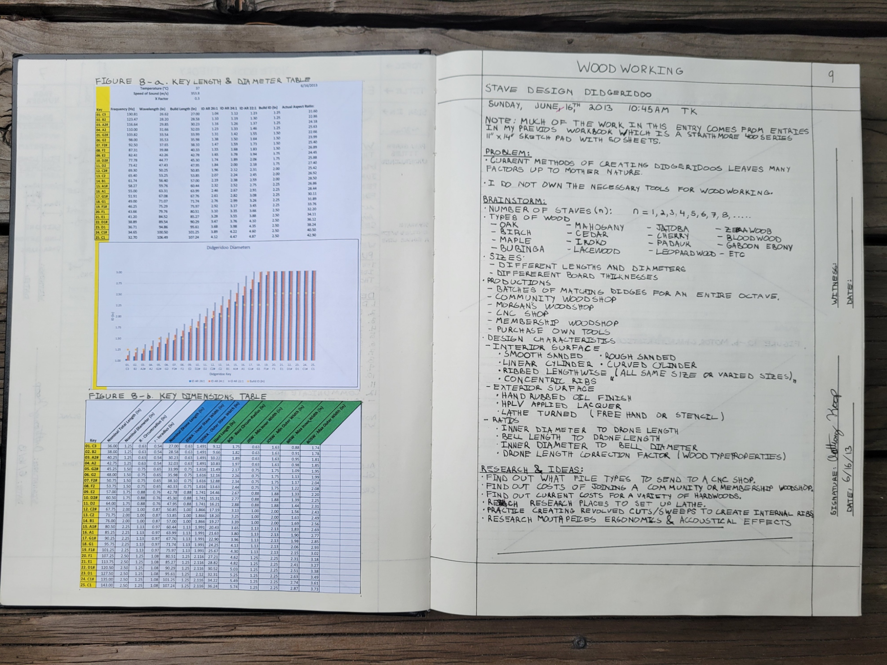

# Didgeridoo — Engineering Documentation for a Stave-Built Wind Instrument

> *A 2013 acoustic study of stave-built didgeridoos across 25 musical keys, plus the engineering documentation, CAD work, and design brainstorming that has accumulated around it since.*


*Didgeridoo blanks and rough-bored bodies on the shop bench — the physical side of the stave-built wind-instrument problem before the acoustic-length math turns into a finished bore.*

## What this is

Engineering documentation for the **stave-built didgeridoo** — a long Australian Aboriginal wind instrument that is traditionally made from a single eucalyptus branch hollowed by termites, but that I have been studying as a precision stave-construction problem since 2013.

The repository combines three threads:

1. **A 2013 acoustic study** I conducted in my engineering notebook covering 25 musical keys (C1–C3, with build lengths from ~27" at C3 up to ~107" at C1), with frequency, wavelength, build length, and stave-width calculations for each key.
2. **CAD geometry** for stave-built didgeridoo bodies derived from that table.
3. **Brainstorming and design work** on internal-surface treatments — smooth, ribbed, concentric-ringed — that shape the instrument's harmonic content.

Sister project to [`djembe`](https://github.com/tonykoop/djembe), [`dundun`](https://github.com/tonykoop/dundun), and [`ashiko-drum-workshop`](https://github.com/tonykoop/ashiko-drum-workshop).

## Background

The didgeridoo (also yiḏaki, mago, and many regional names) is a wind instrument with origins in the cultures of the **Aboriginal peoples of northern Australia**, with continuous documented use for at least 1,500 years and likely much longer. Traditional didgeridoos are made by finding a eucalyptus or bamboo branch hollowed naturally by termites, then trimming and shaping it for sound — a process that yields a unique instrument every time but offers no precise control over pitch or tone.

A **stave-built** didgeridoo is a Western maker's adaptation: rather than relying on termite excavation, the bore is built up from precisely-cut wooden staves glued in a parallel bundle. This trades the natural variability of the traditional instrument for **the ability to target a specific key, length, and bore profile by design.** It also makes locally-sourced North American hardwoods viable — oak, maple, cherry, padauk, and so on — instead of depending on Australian eucalyptus.

## The engineering challenge

A didgeridoo's fundamental frequency is set by the **acoustic length of the bore** and modified by mouthpiece, bell, and bore taper. The basic relationship for a closed-pipe (lip-blown) instrument is:

```
f ≈ c / (4 × L)
```

where `f` is fundamental frequency, `c` is speed of sound at the playing temperature (~37 °C for warm exhaled breath = ~351.8 m/s), and `L` is the effective acoustic length.

In my 2013 notebook study I calculated build dimensions for **25 keys from C1 (32.7 Hz, ~107" long) to C3 (130.8 Hz, ~27" long)**, with stave widths and inner diameters tabulated across three length-to-diameter aspect ratios: 22:1, 24:1, and 26:1. The L:D ratio governs the slenderness of the instrument — at a given length, a narrower bore (higher L:D) produces a darker tone with stronger upper harmonics; a fatter bore yields a brighter, more open sound.

The engineering interest of stave construction is precision: cutting 6, 8, or 12 staves with the right width, taper, and bevel angle to assemble into a target bore is much more controllable than excavating a branch. The stave geometry depends on the target bore diameter and stave count — calculable from the 2013 table.

## Acoustic research

The primary source for this repository is a 2013 lab-notebook entry (witnessed/signed/dated), pictured below:


*The notebook spread: Figure 8-a Key Length & Diameter Table (25 chromatic keys C1–C3), Didgeridoo Diameters bar chart, Figure 8-b Key Dimensions Table, plus brainstorming on stave count, wood species, production paths, and design characteristics. Witnessed and dated.*

Contents of that entry:

- **Figure 8-a — Key Length & Diameter Table.** 25 rows, one per chromatic key from C1 to C3, with fundamental frequency, wavelength at 37 °C, build length, ID at 26:1 / 24:1 / 22:1 aspect ratios, build ID, and actual aspect ratio.
- **Didgeridoo Diameters bar chart** — visual comparison of inner diameters across all 25 keys.
- **Figure 8-b — Key Dimensions Table.** Nominal total length, nominal diameter, outer/inner radius, drone length, stave widths (inner and outer), bevel widths, and minimum/maximum widths per key.
- **Brainstorming notes** on stave count (n = 1 through 8+), wood types (oak, mahogany, cherry, jatoba, maple, lacewood, padauk, etc.), production paths (CNC, community woodshop, Morgan's woodshop, membership shop), and design characteristics (interior surface variants, exterior finishes, bore aspect ratios).
- **Research questions** noted for follow-up: file types accepted by CNC shops, costs of various hardwoods, lathe sourcing, internal-rib practice cuts, mouthpiece ergonomics and acoustic effects.

The notebook page is the closest thing this repository has to a primary source. The entire CAD and jig design effort is downstream of that table.

## CAD and jig design

> *(Forthcoming — actively in progress.)*

Repository structure is laid out for:

- `/CAD/bore-profile/` — the target inner-bore geometry for one or more keys, parametric in length and aspect ratio.
- `/CAD/stave/` — stave geometry derived from the bore profile, varying with stave count `n` and target key.
- `/CAD/jigs/` — the cutting fixtures. Likely one for the bevel angle (similar to the ashiko sled) and one for the optional internal-rib feature (a router fixture or lathe template).

## Build history

> *(Forthcoming — pulling whatever physical builds and prototype photos exist into `/images/`.)*


*In the shop with a peeled didgeridoo log — early stage of a stave-built (or hybrid) build before the bore is established.*

## What this work is for

- **The acoustic question** — calibrating the table against measured pitch from physical builds. Does a stave-built didgeridoo built to the calculated dimensions actually play in tune?
- **The fabrication question** — which combination of stave count, wood selection, and aspect ratio produces the easiest-to-build, best-sounding instrument?
- **The portfolio frame** — for engineers and recruiters: this repository documents an analytical engineering practice (parametric design tables, bore acoustics, stave fabrication math) that I have been refining since 2013, in parallel with my professional engineering career.

## License

Released under [CC-BY 4.0](LICENSE) — use freely with attribution. The didgeridoo as an instrument originates with Aboriginal Australian cultures and has continuous traditional use; the stave-construction methodology, acoustic calculations, CAD work, and analysis in this repository are my own work, free to reuse and adapt with credit.

## Repository structure

```
didgeridoo/
├── README.md                  ← you are here
├── LICENSE                    ← CC-BY 4.0
├── .gitignore
├── research/                  ← 2013 notebook entry + acoustic refs
├── analysis/                  ← parametric calculations, FFT plots (forthcoming)
├── CAD/
│   ├── bore-profile/          ← target inner geometry, by key
│   ├── stave/                 ← stave geometry by key and stave count
│   └── jigs/                  ← bevel sled + optional internal-rib jig
├── drawings/                  ← PDF exports
├── images/                    ← finished-build photos + figures
└── reference/                 ← any reference documents
```

## Status

| Section | Status |
|---|---|
| Repo description, license, gitignore | ✓ done |
| 2013 notebook entry (primary source) | ✓ photographed and committed |
| Hero photo | forthcoming |
| CAD — bore profile geometry | not started |
| CAD — stave geometry | not started |
| CAD — jig designs | not started |
| Physical builds | searching personal archives |

Living document — the primary-source acoustics table is already in place; CAD geometry and recovered physical-build documentation are the main remaining additions.
